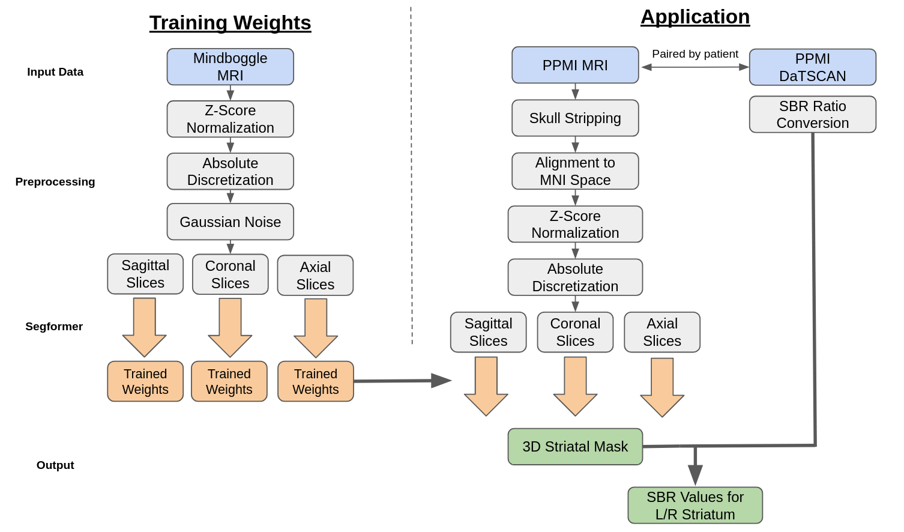
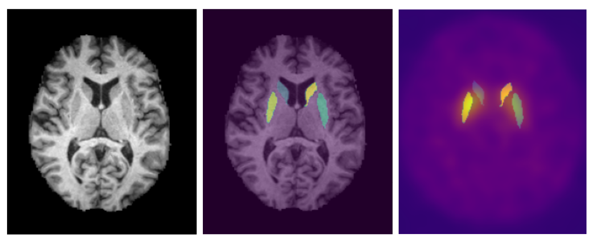

# Methodology

## Data

Our Segformer model underwent training utilizing the dataset provided by
Mindboggle-101 via their open science framework [[3]](#references). This dataset comprises
T1-weighted MRI images, along with man-made volumetric labels that
correspond to distinct cerebral regions. Subsequently, the Segformer
model was subjected to testing using patient data sourced from the
Parkinson’s Progression Markers Initiative (PPMI) database [[4]](#references). This
patient dataset includes T1-weighted MRI images, DaTSCAN SPECT images,
and comprehensive baseline cohort information for each patient. The
image pre-processing workflow for both training and testing phases of
our model is elucidated in Figure 2. Regarding the Mindboggle MRI data,
these images were already skull stripped and conformed to the Montreal
Neurological Institute (MNI) coordinate system. Subsequently, a Z-score
normalization technique was applied to standardize pixel value
distributions.  

**Z-score Normalization** is a technique that scales the values of a
feature to have a mean of 0 and a standard deviation of 1. This initial
step is crucial to standardize all MRI images which were taken across
various systems. The formula for Z-score normalization of a pixel, *x*,
is:
$$
\begin{align*}
x_{new} = \frac{x-\mu}{\sigma}
\end{align*}
$$
where *x**n**e**w* is the new value for the pixel, *μ* is the
average value of the MRI, and *σ* is the standard deviation of the
MRI.  

**Absolute discretization** is a preprocessing technique that takes in
an MRI with a continuous range of values and assigns each pixel to a
discrete bin, where the number of bins is predefined. Literature has
shown that absolute discretization boosts radiomic feature extraction
for MRI images [[1]](#references). For the Segformer preprocessing, a bin size of 256 was
used to cover the range of grayscale. The formula for absolute
discretization is below:
$$
\begin{align*}
x_{new} = 256 * \frac{x-x_{min}}{x_{max}-x_{min}}
\end{align*}
$$
then *x**n**e**w* is converted into an integer, assigning it
to a bin.  

**Gaussian noise** was introduced to the MRI images to add a controlled
level of real-world noise. Upon observation, the Mindboggle dataset was
cleaner than its PPMI counterpart. Since the weights trained off of
Mindboggle are applied to PPMI for segmentation, the noise was added to
bring the two datasets more in line and allow the Segformer model to
account for noisy inputs. The formula for adding Gaussian noise is
below:
$$
\begin{align*}
x_{new} = x + 𝒩(0,3)
\end{align*}
$$
These 3D volumetric images were then converted into 2D slices in the
axial, sagittal, and coronal planes, facilitating their input into the
Segformer model for training.  

**Skull-stripping** of the PPMI MRI images were done using the Robex
package [[2]](#references). The Robex method combines a Random Forest classifier to detect
the brain-skull boundary and a point distribution model to guarantee the
result is possible.  

**The MNI Coordinate System** is a commonly used coordinate system for
brain MRI analysis and the one used by PPMI for their DaTSCAN images.
Each coordinate in the MNI system aligns to a specific location in the
brain. The coordinate (0,0,0) lies center in the brain with the right
hemisphere, front of brain, and top of brain being the positive
direction for the x, y, and z axis respectively.

MRI template using an affine transformation. Following alignment, the
MRI images were subjected to Z-score normalization and absolute
discretization to ensure alignment with the training data. They were
then segmented into 2D slices within the axial, sagittal, and coronal
planes before being incorporated into the model.

For DaTSCAN images, they were matched with MRI images taken at the
closest time point within a year. These DaTSCAN images were already
aligned with the MNI coordinate system but were upscaled to match the
dimensions of the MRI images, resulting in a uniform size of (182, 218,
182). Each image pair was subsequently assigned a patient state label
using information from PPMI’s CONCOHORT section.

## Segformer
The segmentation of the MRI images was conducted using a transformer based semantic segmentation model known as Segformer by Xie et.al. [[5]](#references). Segformer differs from other transformer based segmentation models through its unique hierarchical encoder and multilayer perceptron (MLP) decoder. The hierarchical encoder utilizes 4x4 patch sizes which allows for the generation of both fine and course level features at 1/4, 1/8, 1/16, and 1/32 the original resolution. The MLP decoder then combines the information from all resolution levels into quick and accurate results. Semantic segmentation is the classification of individual pixels into a specific category. We utilized this model to assign each pixel of the MRI to one of 62 labels provided by the Desikan-Killiany-Tourville cortical labeling protocol [[3]](#references). The left and right caudate and putamen are the regions of the brain that can be used to overlay onto the DaTSCAN images and extract the SBR ratio. To utilize the model for the 3D MRI's, the MRI's were sliced into 2D images across the coronal, saggital, and axial planes. The 2D images were then loaded into the model with an output being a 2D matrix of the same size of the MRI slice with the values being the assigned labels to the pixels. 

<figure id="analysis">
    
    <figcaption>Figure 1: Analysis Process Flowchart.</figcaption>
</figure>

<figure id="3images">
    
    <figcaption>Figure 2: Overview of Segformer Process. a) T1-Weighted MRI b) Mask generated from Segformer overlaid on MRI c) Mask generated from Segformer overlaid on DaTSCAN.</figcaption>
</figure>

### References
1. Loïc Duron, Daniel Balvay, Saskia Vande Perre, Afef Bou- chouicha, Julien Savatovsky, Jean-Claude Sadik, Isabelle Thomassin-Naggara, Laure Fournier, and Augustin Lecler. Gray-level discretization impacts reproducible mri radiomics texture features. PLOS ONE, 14(3):1–14, 03 2019.
2. Juan Eugenio Iglesias, Cheng-Yi Liu, Paul M Thompson, and Zhuowen Tu. Robust brain extraction across datasets and comparison with publicly available methods. IEEE transac- tions on medical imaging, 30(9):1617–1634, 2011.
3. Arno Klein and Jason Tourville. 101 labeled brain images and a consistent human cortical labeling protocol. Frontiers in Neuroscience, 6, 2012.
4. T. Marek K. Jennings D. Lasch S. Siderowf A. Tanner C. Simuni. Parkinson progression marker initiative. Progress in neurobiology, pages 629–635, 2011.
5. Enze Xie, Wenhai Wang, Zhiding Yu, Anima Anandkumar, 270 Jose ́M.A ́lvarez,andPingLuo.Segformer:Simpleandef- 271 ficient design for semantic segmentation with transformers. 272 CoRR, abs/2105.15203, 2021