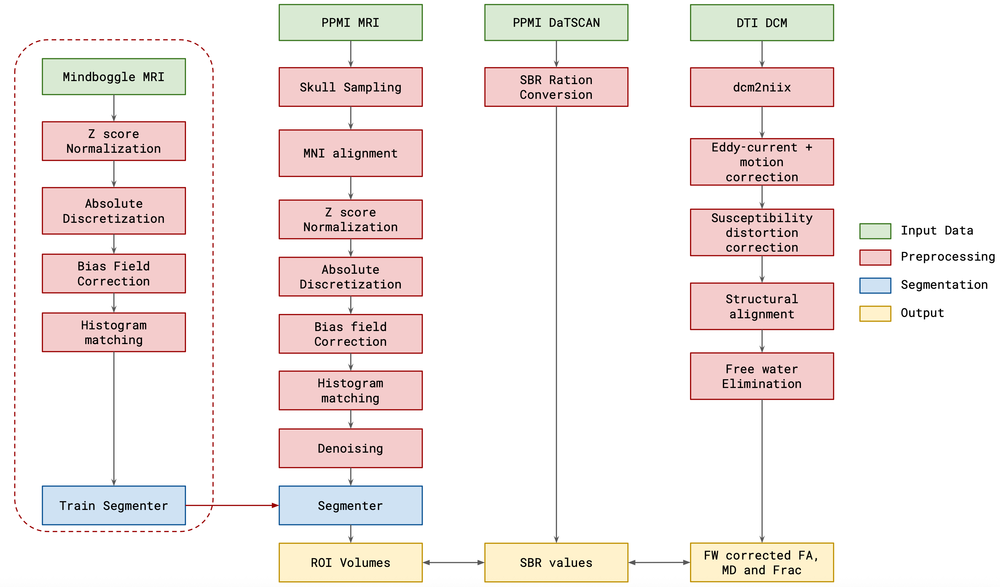
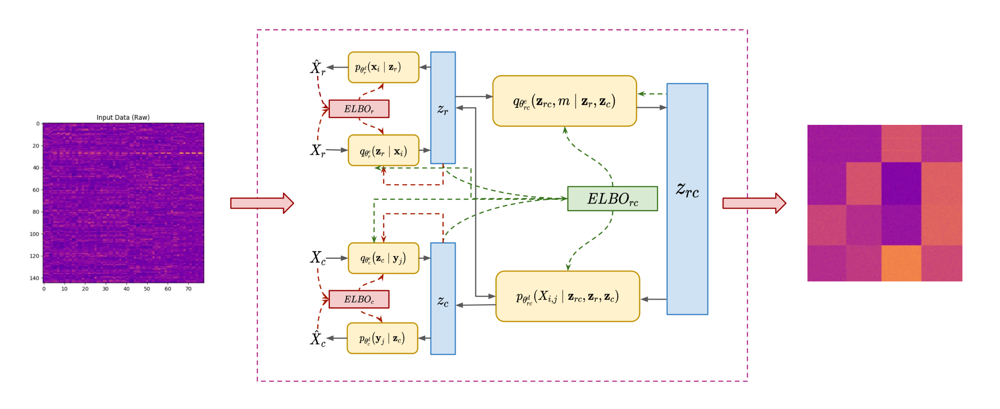

# Diffusion–Clinical Co-Clustering

We fuse free-water–corrected diffusion tensor imaging (DTI) metrics with clinical assessments to construct harmonized multimodal representations. Fractional anisotropy, mean diffusivity, and free-water fraction across subcortical regions join forces with UPDRS and MoCA scores inside a shared feature matrix. Every preprocessing stage runs in a common coordinate system and is capped with modality-specific quality controls, producing a dataset ready for longitudinal modeling.

## SRVCC Architecture

Our scalable robust variational co-clustering (SRVCC) framework employs:

- Dual variational autoencoders for instances and features, each regularized by Gaussian-mixture priors to induce soft cluster assignments.
- A joint latent variable per matrix cell that captures patient–feature interactions through a compositional evidence lower bound (ELBO) optimized with double reparameterized gradients (DREGs).
- Mutual-information cross-losses to align diffusion manifolds with clinical outcomes, preserving coherent row–column partitions even with noise or partial observations.

## Key Outputs

- Three dominant patient clusters emerge along a clear severity gradient, with diffusion asymmetries and clinical decline moving in tandem.
- The pipeline exports a single, analysis-ready table in which each row represents an ROI and each column captures a modality-specific signal (volume, SBR, FA, MD, or free-water fraction).
- Co-clustering results integrate seamlessly with Workflow 1’s generative latent-space modeling, seeding individualized state estimators and policy agents.

This thrust delivers interpretable latent structures that expose how microstructural changes, clinical scores, and dopaminergic depletion co-vary. Detailed formulations are presented in Vinod & Bajaj (2025).
