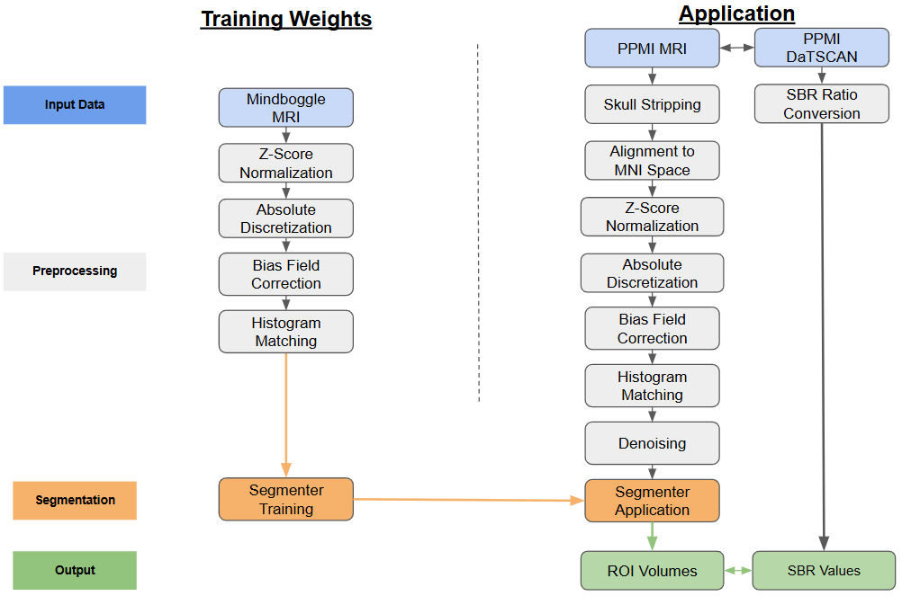
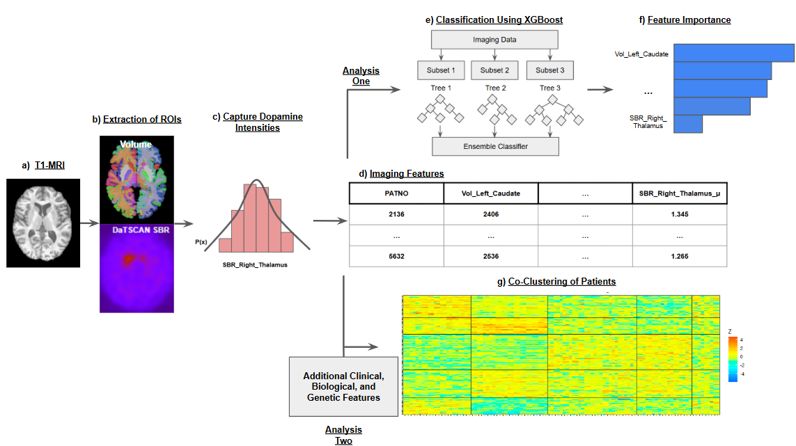
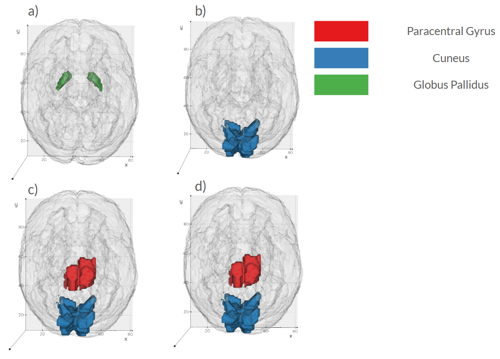

# Imaging Biomarkers: DaTscan + T1 Feature Extraction

We operate a fully automated pipeline that ingests DaT-SPECT and T1-weighted MRI, performs atlas-constrained segmentation, and produces patient-specific biomarker matrices. SegFormer, pretrained on Mindboggle-101 and fine-tuned on PPMI data, generates 108 Desikan–Killiany–Tourville region-of-interest (ROI) masks per subject. Each DaT-SPECT volume is coregistered to MNI space and summarized within every ROI using Gaussian-process moments (mean, standard deviation, skewness, and kurtosis). The resulting imaging matrix—concatenated volumetrics and DaT features—becomes a first-class citizen in downstream classification, ranking, and co-clustering agents.

## Results That Matter

- Imaging alone provides fair discrimination of CSFSAA status, achieving an AUC of 0.70 ± 0.08, with larger cuneus volume and smaller pars opercularis and putamen volumes distinguishing CSFSAA-negative patients.
- Non-imaging anchors such as UPSIT (0.76 ± 0.08) and di-22:6-BMP (0.86 ± 0.08) are strong single-modality predictors; fusing imaging with clinical and biological features yields an AUC of 0.93 ± 0.04.
- Co-clustering with imaging features reveals two SAA-low subgroups (0% and 4% CSFSAA-positive; _p_ < 10⁻³ and _p_ < 10⁻⁴) and one SAA-high subgroup (73.8%; _p_ < 10⁻³).
- Salient imaging drivers concentrate in cuneus volume, paracentral DaT-SPECT skewness, and pallidal DaT-SPECT skewness.

## Why It Matters

This thrust makes DaT-SPECT interpretable at scale by replacing manual ROI definition with reproducible, patient-specific segmentation. It shortens processing from hours to minutes, keeps DaT features paired with structural anatomy, and feeds our multimodal co-clustering and policy agents with harmonized inputs. Full cohort details, preprocessing, and analytics are documented in Dominick & Bajaj (2025).
