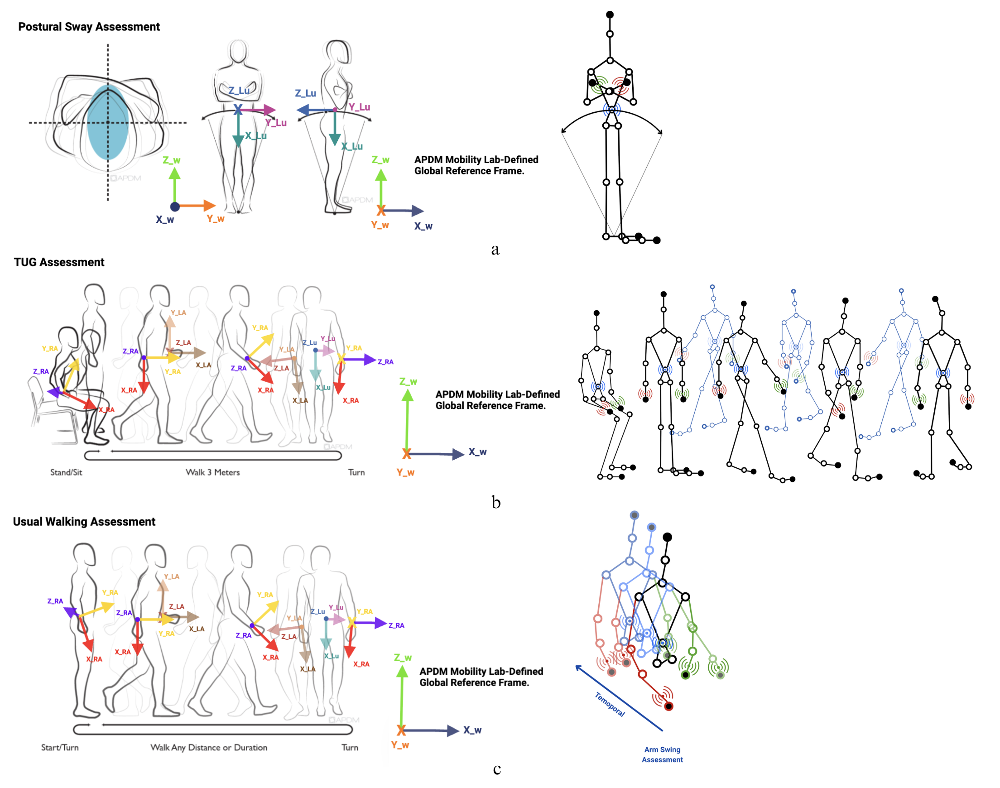

# Wearable–Cognitive Phenotyping

Baseline data from 84 idiopathic Parkinson’s participants in the PPMI Gait and Arm Swing Substudy anchor this thrust. Each participant has confirmed CSF α-synuclein seed amplification assay (CSFSAA) status along with synchronized wearable traces, clinical assessments, and demographics.

## Sensor-Instrumented Mobility Tasks

Three standardized mobility assessments capture complementary aspects of motor function relevant to early PD detection: Postural Sway, Timed Up and Go (TUG), and Dual-Task Walk. APDM Opal sensors on the lumbar spine and both wrists record tri-axial accelerometer and gyroscope signals that yield 50+ gait and arm-swing features measuring amplitude, timing, asymmetry, and coordination.

## Cohorts and Modalities

- **Wearable-derived metrics:** stride regularity, cadence, arm jerk amplitude, asymmetry indices, and postural sway measurements across mobility tasks.
- **Clinical and cognitive assessments:** MDS-UPDRS, Hopkins Verbal Learning Test (HVLT), Epworth Sleepiness Scale, and related behavioral measures.
- **Demographics and biomarkers:** age, sex, disease duration, and ancillary biologic assays.

## Key Findings

- Histogram-based gradient boosting reaches an AUC of 0.93 ± 0.07 for CSFSAA positivity when combining wearable, clinical, and demographic features.
- SHAP analysis highlights HVLT retention, Epworth Sleepiness Scale, and right-arm jerk amplitude as top predictors.
- Gait features alone are less discriminative (AUC 0.58 ± 0.16) but improve multi-modal performance when fused with clinical and demographic data.
- UMAP and spectral co-clustering reveal motor-dominant, multimodal, and cognitive-dominant phenotypes, each reflecting distinct α-synuclein signatures.

This thrust demonstrates that non-invasive sensing complements imaging and biospecimens, offering a scalable path toward remote phenotyping and early detection. Full methodological detail appears in Khalil & Bajaj (2025).
