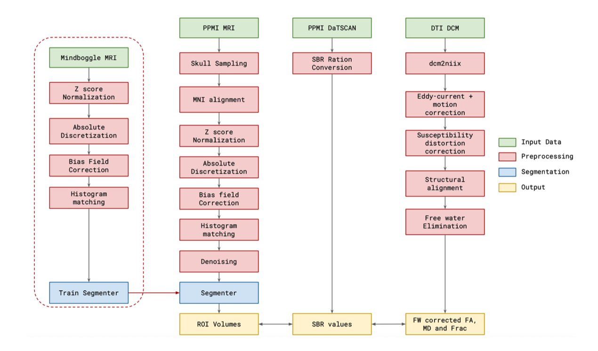
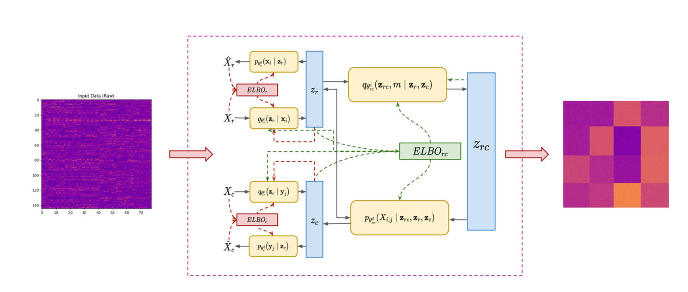

# Multimodal Biomarker Discovery & Co-Clustering for PD Severity

## Goal

Develop a **multimodal co-clustering framework** to discover and prioritize potential Parkinson’s Disease (PD) biomarkers from **diffusion MRI**, **DaTSCAN**, **structural anatomy**, and **core clinical scales**.  
The objective is to jointly cluster participants and features to identify interpretable, coherent blocks that:

- Align with disease severity and trajectory  
- Highlight biomarkers with strong effect sizes and low redundancy  
- Demonstrate cross-site robustness  

These biomarkers will undergo **stability testing**, **longitudinal validation** (predicting UPDRS/MoCA and diffusion changes), and **external-cohort replication**.  
The end goal is to deliver **reproducible biomarkers** supporting:
- Patient stratification  
- Disease progression monitoring  
- Clinical trial enrichment  

---

## Current Progress

### 1. Harmonized Multimodal Feature Pipeline
- Implemented a workflow spanning:
  - **T1 MRI:** Automated ROI segmentation  
  - **DaTSCAN:** Specific Binding Ratio (SBR) extraction  
  - **DTI:** Bi-tensor free-water elimination → tissue-specific FA/MD and free-water fraction  
- All features registered to a **common anatomical scaffold**
- Integrated into a **single quality-controlled feature table**

### 2. Scalable Bayesian Co-Clustering Model
- Trained **SRBCC-coupled VAEs** with **Gaussian-mixture priors** in a **joint latent space**
- Enables joint clustering of **participants and features** while modeling **cell-level structure**

### 3. Cohort Integration
- **Baseline/Prodromal PPMI participants (n=128)**
- Clinical features: **UPDRS-III**, **MoCA**, **QUIP**
- Data standardized into an **analysis-ready matrix**

### 4. Severity-Aligned Subtypes
- Co-clustering identifies **patient subtypes** with:
  - Distinct **cortico-striatal** and **brain-stem diffusion** patterns  
  - Significant explanation of **UPDRS progression variance**

### 5. Biological Consistency & Specificity
- **Free-water–corrected diffusion metrics** (FA/MD + FW fraction) enhance:
  - **Sensitivity** to tissue injury .
  - **Specificity** to PD pathology .
  - Reduced confounding from fluid-related artifacts

### 6. Methodological Advantage
- Outperforms **k-means**, **spectral bi-clustering**, and **deep-clustering baselines**
- Improved:
  - **Clustering purity**
  - **Severity-prediction accuracy**
- Retains **interpretability** via patient-feature block structures

## Compositional Co-Clustering for PD Severity
**From imaging + clinical signals to actionable patient subtypes**

Parkinson’s is heterogeneous, which makes prognosis and therapy personalization hard. Our latest paper introduces a **Scalable Robust Variational Co-Clustering (SRVCC)** framework that jointly models **free-water–corrected DTI biomarkers** and **core clinical scores** to reveal coherent PD subtypes along a severity gradient.

### What’s new
- **True multimodal fusion** — combines region-wise DTI (FA/MD), DaTSCAN SBR, volumetrics, and bedside scales (UPDRS-III, UPDRS total, MoCA; QUIP where available).
- **Free-water–eliminated diffusion** — bi-tensor FW-DTI pipeline reduces CSF contamination, sharpening microstructural sensitivity.
- **Compositional Bayesian co-clustering** — paired Gaussian-mixture priors align **patient clusters** and **feature clusters**; a mutual-information cross-loss preserves clinically meaningful structure.
- **Robustness at scale** — doubly reparameterized KL terms and contrastive guards prevent posterior collapse and tame noise.

### Cohort & biomarkers we model
- **Dataset:** 128 PPMI participants (Baseline + Prodromal) with harmonized structural MRI, diffusion MRI, DaTSCAN, and clinical assessments.
- **Regions:** 28 cortical/subcortical ROIs (e.g., thalamus, caudate, putamen, pallidum, hippocampus, brainstem).
- **Pipeline (see figure):** MRI/DaTSCAN normalization → alignment to T1 → **FW-DTI** fitting → ROI sampling → single feature table per subject.

### Headline results
SRVCC uncovers **three stable patient subtypes** that track clinical severity and imaging asymmetries:

- **Mild** — MoCA ≈ **28.5**; UPDRS-III ≈ **10**; near-symmetric thalamic MD; caudate FA close to symmetric.  
- **Moderate** — MoCA ≈ **25**; UPDRS-III ≈ **20**; intermediate diffusion changes.  
- **Severe** — MoCA ≈ **22**; UPDRS-III ≈ **30**; **thalamic MD asymmetry rises ~5×** (≈ **0.02 → 0.10**); **caudate FA asymmetry becomes more negative** (≈ **−0.01 → −0.06**).  
- **Benchmarks:** Outperforms k-means, spectral bi-clustering, and recent deep-clustering baselines on clustering purity and severity-prediction error—while remaining biologically interpretable.

### Why this matters
- **Precision stratification:** identifies who is “mild but at risk” vs “diffuse severe,” enabling trial enrichment and tailored follow-ups.
- **Imaging-backed targets:** thalamic MD and caudate FA asymmetries surface as robust, **trackable** biomarkers alongside MoCA and UPDRS-III.
- **Feeds our progressive agents:** clusters + feature weights plug into our policy models to personalize **combination / sequence / timing** of therapies for each profile.

### Figures to embed

1. **Multimodal Feature Extraction Pipeline**  

2. **SRVCC Co-Clustering Schematic & Checkerboard Heatmap**  

## Upcoming Milestones

###  Longitudinal Validation
- Test **subtype stability** and **prognostic value** over time:
  - UPDRS/MoCA trajectories  
  - Diffusion metric change rates  

###  Richer Multimodal Integration
- Add **CSF biomarkers** (e.g., α-synuclein), **genetic data**, and **extended cortical/subcortical features**

###  Generalization
- Validate clustering and severity gradients in **external cohorts**
- Stress-test across **scanners** and **protocol variations**

###  Translational Tools
- Package the pipeline and subtype assignment into a **reproducible module** for:
  - Trial stratification  
  - Monitoring applications  

---

### Feature-Subset Design for Co-Clustering

 Objectives
- [ ] Add a **single-clustering feature selector (SCFS)** that picks a compact, stable, mechanism-rich feature subset.  
- [ ] Group features into **pathway-coherent packs** (e.g., “Nigrostriatal::Putamen::DTI_MD_AI”), and select **packs as units**.  
- [ ] Run **co-clustering only on the kept packs**, preserving pathway coherence.  
- [ ] Produce **patient-level majority mechanism** tags (e.g., dopaminergic vs thalamo-striatal disconnection).  

---

## setup
- Integrated patient × feature matrix spanning:
  - **DTI** (FA, MD, FW; free-water corrected), **DAT SBR**, **MRI** (volumes; cortical thickness/area where applicable), **Clinical** (UPDRS-III, MoCA).
- ROI namespaces present:
  - **Subcortex & Cortex (FS)**: e.g., Thalamus-Proper, Caudate, Putamen, Pallidum, Hippocampus, Amygdala, Accumbens, lh/rh gyri (Precentral, Paracentral, Cingulate, OFC, etc.), Brain-Stem, Optic-Chiasm.
  - **CerebNet**: lobes (Anterior/Posterior/Flocculonodular), vermis groups, deep nuclei (Dentate/Interposed/Fastigial), deep/superficial WM/Cortex.
  - **HypVINN**: Anterior/Middle/Posterior Hypothalamus, Mammillary-Body, Preoptic-Area, Infundibulum, Periventricular GM; optic nerve/radiation/chiasm.
- Exclusion/irrelevant candidates: **Ventricles** (3rd/4th/Lateral & inf-lat), **Vessel** L/R, **Choroid-Plexus** L/R, **WM-hypointensities** (total/L/R), **Unknown**.

---

## A) Build the Pathway Map (one-time artifact)

For each feature (column), populate its `pathway` and `mechanism_bin`. This mapping will drive penalties, coverage, and grouping.

**Mechanism bins:**
- **Nigrostriatal / Dopaminergic:** Caudate, Putamen, Pallidum, Accumbens, (relay) Thalamus-Proper, Brain-Stem.  
- **Thalamo-Striatal (Motor loop):** Thalamus-Proper; lh/rh Precentral, Paracentral, Postcentral.  
- **Limbic–Cognitive:** Hippocampus, Amygdala; lh/rh Parahippocampal, Entorhinal, Medial/Lateral OFC, Posterior/Caudal Anterior Cingulate.  
- **Associative / DLPFC:** lh/rh Caudal/Rostral Middle Frontal, Superior Frontal; Inferior Parietal; Precuneus.  
- **Cerebellar Motor-Assist (CerebNet):** Deep nuclei (Dentate/Interposed/Fastigial), lobes (Ant/Post/Flocculonodular), vermis groups, WM/Cortex deep & superficial.  
- **Hypothalamic / Autonomic (HypVINN):** Ant/Mid/Post Hypothalamus; Mammillary-Body, Preoptic-Area, Infundibulum, Periventricular GM.  
- **Nuisance / Low-specificity:** Ventricle labels, Vessel, Choroid-Plexus, WM-hypointensities, Unknown.

#### SCFS with **Pack Grouping** (single pass)
We'll select a compact set of **packs** (not individual features) that are stable and pathway-rich.

**Sparse K-Means (single pass) with group-L1**  
- Groups = **pack_id** (select/drop as a unit).  
- **K**: start at 3 (search 3–5 via Gap/PAC).  
- **Penalty multipliers** by mechanism_bin (encourage PD-critical pathways):

We’ll run 200 bootstrap repeats and keep any feature pack that’s selected at least 70% of the time.
To stay biologically meaningful, we require at least one kept pack from each key pathway: nigrostriatal, thalamo-striatal, limbic–cognitive, cerebellar, and hypothalamic.
We’ll also keep the mix balanced so each modality (DTI, DAT, MRI) makes up at least 15% of the final features, lowering its penalty and re-fitting if it’s under-represented.

---