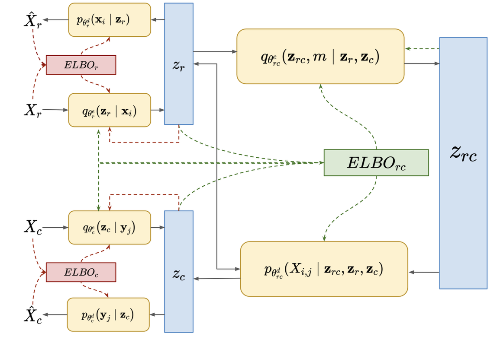
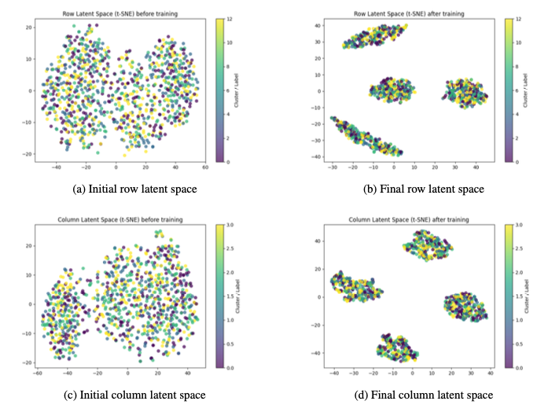
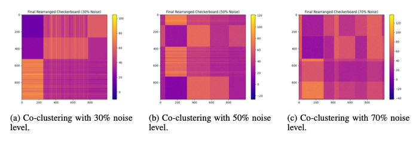
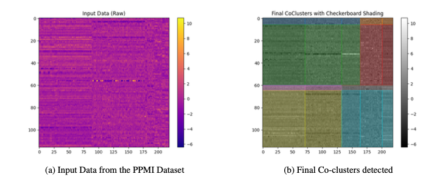
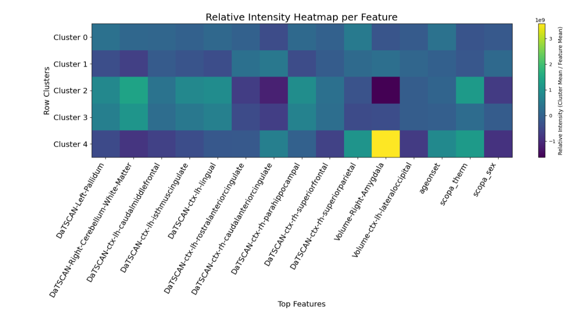

## Scalable Robust Bayesian Co-Clustering with Compositional ELBOs
**Unified variational learning for robust co-clustering across modalities**  
_Ashwin Vinod, Chandrajit Bajaj — University of Texas at Austin_

We introduce a **Scalable Robust Bayesian Co-Clustering (SRVCC)** framework that learns **row and column clusters simultaneously** within a **variational latent space**, making co-clustering robust to **noise**, **sparsity**, and **posterior collapse**

---

### Key Idea
Traditional co-clustering methods—like spectral, modularity, or NMF-based techniques—struggle with large, noisy, or non-linear datasets. SRVCC resolves this by integrating:
- **Variational Autoencoders (VAEs)** for non-linear feature learning.  
- **Gaussian Mixture Priors (GMMs)** to induce clustering structure.  
- **Compositional ELBOs** and **mutual information cross-loss** to jointly regularize rows, columns, and cell-level interactions.

The result is a **fully generative**, **end-to-end** co-clustering model that simultaneously discovers interpretable patterns in both instance and feature dimensions.

---

###  Architecture Overview
SRVCC is built on **three interconnected variational spaces**:

1. **Row VAE (Instance-Side):** Encodes each instance into a GMM latent space, reconstructing rows and assigning soft memberships \( \gamma^r_i \).  
2. **Column VAE (Feature-Side):** Encodes features analogously into their own mixture space \( \gamma^c_j \).  
3. **Joint Cell VAE:** Introduces a latent variable \( z_{rc} \) for every matrix cell to capture **row–column interactions** and noise.  

Each space contributes an **Evidence Lower Bound (ELBO)** term. These are composed into a **Compositional ELBO**—a robust training objective that balances reconstruction, clustering alignment, and noise control.

> 📊 *Figure below* illustrates the three-level variational co-clustering pipeline, where rows and columns are encoded via separate VAEs and fused through a joint ELBO term.

---

### 🧩 Methodological Innovations
- **Doubly Reparameterized Gradients (DREGs):** Reduces gradient variance in stochastic ELBO estimation, stabilizing training.  
- **Scale-Adjusted Latents:** Increases encoder latent means only along the reconstruction path to mitigate **posterior collapse** 
- **Contrastive Cross-Loss:** Encourages discriminative embedding alignment between true and corrupted data pairs.  
- **Mutual Information Regularization:** Aligns row and column clusters by maximizing \( I(X;Y) \) preservation under the learned co-cluster assignments.

---

###  Experimental Highlights
Benchmarked on **image and web/text datasets**, SRVCC consistently exceeds prior co-clustering and deep clustering methods:

| Dataset | DeepCC ACC | **SRVCC ACC** | DeepCC NMI | **SRVCC NMI** |
|----------|-------------|---------------|-------------|----------------|
| **Yale** | 53.3 ± 1.4 | **58.1 ± 1.7** | 55.7 ± 1.1 | **61.0 ± 1.5** |
| **Fashion-MNIST** | 62.7 ± 1.6 | **68.2 ± 1.8** | 60.4 ± 0.7 | **65.0 ± 1.6** |
| **WebKB-Wisconsin** | 77.4 ± 1.4 | **81.6 ± 2.2** | 46.7 ± 1.7 | **51.5 ± 1.6** |

> SRVCC achieves **+4–8 % accuracy gains** and **+3–6 % NMI improvements** on average across benchmarks:

---

###  Robustness to Noise
SRVCC maintains stable co-cluster structures even under **50–70 % data corruption**, thanks to its two-stage compositional ELBO that separately models noise at both the **instance/feature** and **cell** levels.  
> *Figures below* visualize latent space evolution and co-cluster resilience under increasing noise intensities.

---

### Applications 
Applied to the **PPMI Parkinson’s Disease dataset**, SRVCC identifies **five biologically interpretable patient clusters** that align with motor and cognitive scores (UPDRS-III, MoCA) and **DaTSCAN/MRI biomarkers**:

| Cluster | Description |
|----------|--------------|
| **Cluster 2** | Mild outlier: UPDRS-III = 6, MoCA = 29 — early PD profile |
| **Cluster 3** | Older onset, preserved DaTSCAN uptake, moderate motor range |
| **Cluster 0/1/4** | Moderate PD subgroups with varying cognitive decline and ag. |

> *Figure below* show co-cluster heatmaps revealing feature groupings across imaging and clinical domains.

---

### Key Outcomes
- **Unified multimodal clustering:** Learns instance, feature, and interaction embeddings in one probabilistic model.  
- **Noise-tolerant inference:** Handles missing, sparse, and corrupted data gracefully.  
- **Interpretability:** Produces checkerboard co-cluster maps that directly reveal cross-domain associations.  
- **Scalability:** Linear complexity in dataset size and cluster count, making it feasible for high-dimensional biomedical and web data.

---

###  Reference
Vinod, Ashwin, and Chandrajit Bajaj. "Scalable Robust Bayesian Co-Clustering with Compositional ELBOs." arXiv preprint arXiv:2504.04079 (2025).

---
